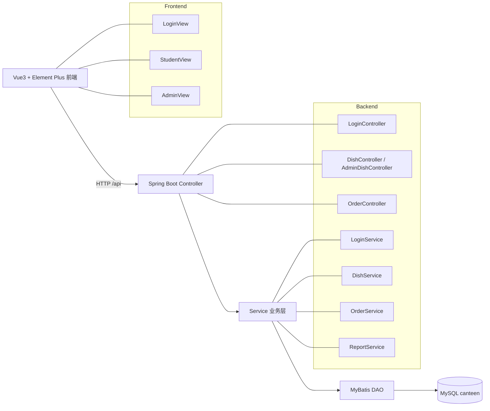

# 校园食堂订餐系统（canteen-sys）

一个前后端分离的教学项目：学生可浏览明日菜单并下单，管理员可维护菜品并查看明日备餐统计。

## 系统架构

## 技术栈

- 后端：`Java 17`、`Spring Boot 3`、`MyBatis`、`MySQL`
- 前端：`Vue 3`、`Vite`、`Vue Router`、`Element Plus`
- 构建与 CI：`Maven`、`npm`、`GitHub Actions`

## 目录结构

- `canteen-server/`：后端服务
  - `src/main/java/com/canteen/controller`：接口层
  - `src/main/java/com/canteen/service`：业务逻辑层
  - `src/main/java/com/canteen/dao`：MyBatis DAO 接口
  - `src/main/java/com/canteen/entity`：领域实体
  - `src/main/resources/mappers`：MyBatis SQL 映射
  - `src/main/resources/db.sql`：建表与初始化数据脚本
- `frontend/`：前端项目
  - `src/views/LoginView.vue`：登录页
  - `src/views/StudentView.vue`：学生端（看菜单/下单/我的订单）
  - `src/views/AdminView.vue`：管理员端（统计/菜品管理）
- `.github/workflows/ci.yml`：CI 流水线定义
- `docs/iteration-report.md`：本次迭代书面报告（维护性 + TDD + 文档）

## 核心业务模块职责

- `LoginController` + `LoginService`
  - 用户身份校验，返回用户角色（`student/admin`）
- `DishController` + `DishService`
  - 学生侧“明日菜单”查询
- `AdminDishController` + `DishService`
  - 管理员按供餐日维护菜品（增删改查）
  - 删除前做订单关联检查，避免破坏历史订单
- `OrderController` + `OrderService`
  - 学生下单、查询个人订单、取消明日订单、更新份量
- `ReportService`
  - 按供餐日统计订餐人数、订单数、菜品需求量（半份按 0.5 计）

## 本地开发环境搭建

### 1) 前置软件

- `JDK 17`
- `Maven 3.9+`
- `Node.js 18+`（建议 npm 9+）
- `MySQL 8.x`

### 2) 初始化数据库

1. 创建数据库：
   - `CREATE DATABASE canteen DEFAULT CHARACTER SET utf8mb4;`
2. 执行脚本：
   - `canteen-server/src/main/resources/db.sql`
3. 根据本机修改后端配置：
   - `canteen-server/src/main/resources/application.properties`
   - 重点确认 `spring.datasource.url/username/password`

### 3) 启动后端

在 `canteen-server` 目录执行：

- `mvn clean spring-boot:run`

默认后端地址：`http://localhost:8080`

### 4) 启动前端

在 `frontend` 目录执行：

- `npm install`
- `npm run dev`

默认前端地址：`http://localhost:5173`

> 若前后端端口不一致，请在前端开发代理或后端跨域配置中统一。

## 测试与 CI

- 后端单元测试目录：`canteen-server/src/test/java`
- 本地执行：
  - `cd canteen-server && mvn clean test`
- CI 自动执行：
  - `.github/workflows/ci.yml` 在 `push/pull_request -> develop` 时执行后端 `mvn clean test`，并构建前端 `npm run build`

## 团队成员

- 樊世奇（学号：9107123050）- Product Owner (PO)
- 李晨希（学号：9109223109）- Scrum Master (SM)
- 郑茹怡（学号：9109223175）- Development Team
