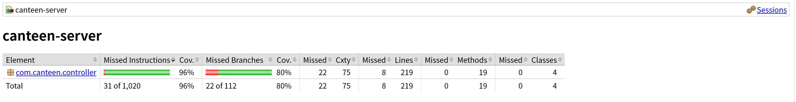

# AI 辅助测试 Prompt 演化实验（回扣 8-1）

## 案例 1：`OrderController#createOrder`

### 初始 Prompt

```text
请帮我给 OrderController 写单元测试，覆盖创建订单接口。
```

### AI 输出问题

- 重言式测试：只断言 200，不断言 `success/message`。
- 边界缺失：未覆盖 `portion` 非法、菜品不在明日菜单。
- Mock 不完整：遗漏 `UserDAO`/`DishService` 协作分支。

### 改进 Prompt（结构化指令 + Few-shot）

```text
你是资深 Java 测试工程师。请为 Spring Boot 的 OrderController 编写 WebMvcTest，
使用 MockMvc + Mockito，不连接数据库。

目标：POST /api/orders（createOrder）
必须覆盖：
1) portion 非 whole/half -> success=false, message=份量须为 whole 或 half
2) dish.menuDate != tomorrow -> success=false, message=该菜品不在明日可订菜单中
3) submitOrder=true -> success=true, message=订单创建成功，且返回 orderId

约束：
- 每个用例必须断言 success 和 message
- 失败分支需要 verify(..., never()) 证明未误调用写操作
- 按如下风格输出：
  andExpect(jsonPath("$.success").value(false))
  andExpect(jsonPath("$.message").value("xxx"))
```

### 最终可用测试代码

```java
package com.canteen.controller;

import com.canteen.dao.UserDAO;
import com.canteen.entity.Dish;
import com.canteen.entity.Order;
import com.canteen.entity.User;
import com.canteen.service.DishService;
import com.canteen.service.OrderService;
import com.canteen.service.ReportService;
import org.junit.jupiter.api.Test;
import org.springframework.beans.factory.annotation.Autowired;
import org.springframework.boot.test.autoconfigure.web.servlet.WebMvcTest;
import org.springframework.boot.test.mock.mockito.MockBean;
import org.springframework.http.MediaType;
import org.springframework.test.web.servlet.MockMvc;

import static org.mockito.ArgumentMatchers.any;
import static org.mockito.Mockito.never;
import static org.mockito.Mockito.verify;
import static org.mockito.Mockito.when;
import static org.springframework.test.web.servlet.request.MockMvcRequestBuilders.post;
import static org.springframework.test.web.servlet.result.MockMvcResultMatchers.jsonPath;
import static org.springframework.test.web.servlet.result.MockMvcResultMatchers.status;

@WebMvcTest(OrderController.class)
class OrderControllerMockTest {

    @Autowired
    private MockMvc mockMvc;

    @MockBean
    private OrderService orderService;
    @MockBean
    private ReportService reportService;
    @MockBean
    private DishService dishService;
    @MockBean
    private UserDAO userDAO;

    @Test
    void createOrder_shouldRejectWhenPortionInvalid() throws Exception {
        User student = new User("stu1", "123", "student", "张三");
        when(userDAO.findByUsername("stu1")).thenReturn(student);

        mockMvc.perform(post("/api/orders")
                        .contentType(MediaType.APPLICATION_JSON)
                        .content("""
                                {"username":"stu1","dishId":"D001","portion":"quarter"}
                                """))
                .andExpect(status().isOk())
                .andExpect(jsonPath("$.success").value(false))
                .andExpect(jsonPath("$.message").value("份量须为 whole 或 half"));

        verify(dishService, never()).getDishById(any());
        verify(orderService, never()).submitOrder(any());
    }

    @Test
    void createOrder_shouldRejectWhenDishNotInTomorrowMenu() throws Exception {
        User student = new User("stu1", "123", "student", "张三");
        Dish dish = new Dish("D001", "红烧肉", 20.0, "desc", "2099-01-01");
        when(userDAO.findByUsername("stu1")).thenReturn(student);
        when(dishService.getDishById("D001")).thenReturn(dish);
        when(orderService.getTomorrowDate()).thenReturn("2099-01-02");

        mockMvc.perform(post("/api/orders")
                        .contentType(MediaType.APPLICATION_JSON)
                        .content("""
                                {"username":"stu1","dishId":"D001","portion":"whole"}
                                """))
                .andExpect(status().isOk())
                .andExpect(jsonPath("$.success").value(false))
                .andExpect(jsonPath("$.message").value("该菜品不在明日可订菜单中"));

        verify(orderService, never()).submitOrder(any());
    }

    @Test
    void createOrder_shouldReturnSuccessWhenSubmitSucceeded() throws Exception {
        User student = new User("stu1", "123", "student", "张三");
        Dish dish = new Dish("D001", "红烧肉", 20.0, "desc", "2099-01-02");
        Order order = new Order();
        order.setOrderId("O1001");
        order.setUsername("stu1");

        when(userDAO.findByUsername("stu1")).thenReturn(student);
        when(dishService.getDishById("D001")).thenReturn(dish);
        when(orderService.getTomorrowDate()).thenReturn("2099-01-02");
        when(orderService.createOrder(student, dish, "whole")).thenReturn(order);
        when(orderService.submitOrder(order)).thenReturn(true);

        mockMvc.perform(post("/api/orders")
                        .contentType(MediaType.APPLICATION_JSON)
                        .content("""
                                {"username":"stu1","dishId":"D001","portion":"whole"}
                                """))
                .andExpect(status().isOk())
                .andExpect(jsonPath("$.success").value(true))
                .andExpect(jsonPath("$.message").value("订单创建成功"))
                .andExpect(jsonPath("$.order.orderId").value("O1001"));
    }
}
```

## 案例 2：`AdminDishController#save/#delete`

### 初始 Prompt

```text
给管理员菜品接口写几个测试。
```

### AI 输出问题

- 仅 happy path，未覆盖权限分支。
- 未覆盖 `menuDate` 非法格式、负价格、空字段。
- 未覆盖“关联订单不可删除”的业务约束。

### 改进 Prompt（CoT 分步骤 + 角色扮演）

```text
你扮演“代码评审 + 测试设计师”。
先按分支清单设计，再输出最终测试代码（不输出思维链）。

模块：AdminDishController（WebMvcTest + MockBean）
必须覆盖：
Step1 非 admin 查询列表失败：message=无权限管理菜品
Step2 save 入参校验：menuDate 非 yyyy-MM-dd 失败
Step3 save 数据清洗：id/name/menuDate trim，description null -> ""
Step4 delete 业务约束：countByDishId > 0 时失败
Step5 delete 成功分支：success=true

规则：
- 每个测试断言 success + message（或关键字段）
- 至少一个失败分支断言 never()
```

### 最终可用测试代码

```java
package com.canteen.controller;

import com.canteen.dao.OrderDAO;
import com.canteen.dao.UserDAO;
import com.canteen.entity.Dish;
import com.canteen.entity.User;
import com.canteen.service.DishService;
import org.junit.jupiter.api.Test;
import org.springframework.beans.factory.annotation.Autowired;
import org.springframework.boot.test.autoconfigure.web.servlet.WebMvcTest;
import org.springframework.boot.test.mock.mockito.MockBean;
import org.springframework.http.MediaType;
import org.springframework.test.web.servlet.MockMvc;

import static org.mockito.ArgumentMatchers.any;
import static org.mockito.Mockito.never;
import static org.mockito.Mockito.verify;
import static org.mockito.Mockito.when;
import static org.springframework.test.web.servlet.request.MockMvcRequestBuilders.delete;
import static org.springframework.test.web.servlet.request.MockMvcRequestBuilders.get;
import static org.springframework.test.web.servlet.request.MockMvcRequestBuilders.post;
import static org.springframework.test.web.servlet.result.MockMvcResultMatchers.jsonPath;
import static org.springframework.test.web.servlet.result.MockMvcResultMatchers.status;

@WebMvcTest(AdminDishController.class)
class AdminDishControllerMockTest {

    @Autowired
    private MockMvc mockMvc;

    @MockBean
    private UserDAO userDAO;
    @MockBean
    private DishService dishService;
    @MockBean
    private OrderDAO orderDAO;

    @Test
    void list_shouldRejectWhenNotAdmin() throws Exception {
        when(userDAO.findByUsername("stu1")).thenReturn(new User("stu1", "123", "student", "张三"));

        mockMvc.perform(get("/api/admin/dishes").param("username", "stu1"))
                .andExpect(status().isOk())
                .andExpect(jsonPath("$.success").value(false))
                .andExpect(jsonPath("$.message").value("无权限管理菜品"));

        verify(dishService, never()).getAllDishes();
    }

    @Test
    void save_shouldRejectWhenDateInvalid() throws Exception {
        when(userDAO.findByUsername("admin")).thenReturn(new User("admin", "123", "admin", "管理员"));

        mockMvc.perform(post("/api/admin/dishes")
                        .param("username", "admin")
                        .contentType(MediaType.APPLICATION_JSON)
                        .content("""
                                {"id":"D001","name":"鱼香肉丝","price":18.5,"description":"desc","menuDate":"2099/01/02"}
                                """))
                .andExpect(status().isOk())
                .andExpect(jsonPath("$.success").value(false))
                .andExpect(jsonPath("$.message").value("供餐日须为 yyyy-MM-dd 格式"));

        verify(dishService, never()).saveDish(any());
    }

    @Test
    void save_shouldTrimFieldsAndSucceed() throws Exception {
        when(userDAO.findByUsername("admin")).thenReturn(new User("admin", "123", "admin", "管理员"));
        when(dishService.saveDish(any(Dish.class))).thenReturn(true);

        mockMvc.perform(post("/api/admin/dishes")
                        .param("username", "admin")
                        .contentType(MediaType.APPLICATION_JSON)
                        .content("""
                                {"id":" D002 ","name":" 糖醋里脊 ","price":20.0,"description":null,"menuDate":" 2099-01-03 "}
                                """))
                .andExpect(status().isOk())
                .andExpect(jsonPath("$.success").value(true))
                .andExpect(jsonPath("$.message").value("保存成功"))
                .andExpect(jsonPath("$.dish.id").value("D002"))
                .andExpect(jsonPath("$.dish.name").value("糖醋里脊"))
                .andExpect(jsonPath("$.dish.menuDate").value("2099-01-03"))
                .andExpect(jsonPath("$.dish.description").value(""));
    }

    @Test
    void delete_shouldRejectWhenDishHasOrders() throws Exception {
        when(userDAO.findByUsername("admin")).thenReturn(new User("admin", "123", "admin", "管理员"));
        when(orderDAO.countByDishId("D003")).thenReturn(2);

        mockMvc.perform(delete("/api/admin/dishes/D003")
                        .param("username", "admin"))
                .andExpect(status().isOk())
                .andExpect(jsonPath("$.success").value(false))
                .andExpect(jsonPath("$.message").value("该菜品已有 2 条关联订单，无法删除。可修改供餐日或保留记录。"));

        verify(dishService, never()).deleteDishById(any());
    }

    @Test
    void delete_shouldReturnSuccessWhenRemoved() throws Exception {
        when(userDAO.findByUsername("admin")).thenReturn(new User("admin", "123", "admin", "管理员"));
        when(orderDAO.countByDishId("D004")).thenReturn(0);
        when(dishService.deleteDishById("D004")).thenReturn(true);

        mockMvc.perform(delete("/api/admin/dishes/D004")
                        .param("username", "admin"))
                .andExpect(status().isOk())
                .andExpect(jsonPath("$.success").value(true))
                .andExpect(jsonPath("$.message").value("已删除"));
    }
}
```

## 覆盖率截图（核心 API 模块）

- 覆盖率报告：`canteen-server/target/site/jacoco/index.html`
- 核心 API（`com.canteen.controller`）：`Lines 96%`，`Branches 80%`


