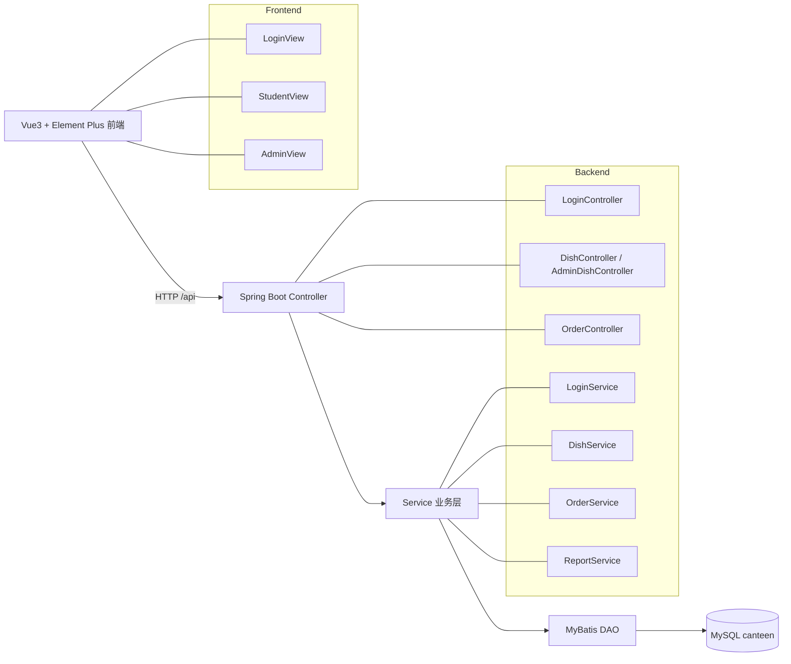

# 迭代书面报告（维护性自评 + TDD 回归 + 文档补全）

## 1. 可维护性五因素自评（1-5 分）

评估依据参考教材 §8.4.1：可理解性、可测试性、可修改性、可移植性、可重用性。

| 因素 | 评分 | 现状说明 |
| --- | --- | --- |
| 可理解性 | 3 | 代码已按 `controller/service/dao/entity` 分层，命名基本直观；但部分注释偏口语、约束规则分散在控制器中。 |
| 可测试性 | 2 | 迭代前仅有 `contextLoads`，缺少对业务规则（半份计价、统计聚合、明日菜单）的自动化回归保护。 |
| 可修改性 | 3 | 主要业务已拆到 `OrderService`、`ReportService`，职责比早期清晰；但仍有控制器方法过长、校验逻辑与流程耦合。 |
| 可移植性 | 2 | 对本地环境依赖较强（MySQL 本机配置、时区/日期处理依赖 JVM 默认时区），且缺少容器化或统一启动脚本。 |
| 可重用性 | 2 | 通用能力沉淀较少，DTO/校验/错误响应结构未统一，很多逻辑仍以内联方式出现在接口方法中。 |

### 低于 3 分因素的改进方案

#### A) 可测试性（2 分）改进方案

1. **分层测试策略落地**  
   - Service 层：使用 Mockito 单测验证核心业务规则；  
   - Controller 层：使用 MockMvc 做参数校验与权限分支测试；  
   - DAO 层：用测试库（如 H2 或 Testcontainers MySQL）做 SQL 映射验证。
2. **回归基线建设**  
   - 关键用例（下单、取消、统计、菜品管理）至少维护 1 条成功 + 1 条失败路径。  
3. **CI 质量门禁**  
   - 保持 PR 必过 `mvn test`；后续可补充 JaCoCo 覆盖率阈值（例如行覆盖率 >= 60%）。

#### B) 可移植性（2 分）改进方案

1. **环境参数外置**  
   - 使用 `.env`/profile 或启动参数管理数据库连接，避免把本机配置写死在默认配置。  
2. **容器化标准环境**  
   - 增加 `docker-compose`（MySQL + backend + frontend）降低新成员环境差异。  
3. **时区与日期策略统一**  
   - 将 `DateUtils` 改为 `java.time` 并显式指定时区，避免跨机器日期边界偏差。

#### C) 可重用性（2 分）改进方案

1. **统一请求/响应模型**  
   - 引入统一响应体（如 `ApiResponse<T>`）与错误码，减少重复 `Map<String,Object>` 拼装。  
2. **抽离通用校验与鉴权**  
   - 用户角色校验、参数合法性校验改为可复用组件（AOP/拦截器/Validator）。  
3. **沉淀领域服务接口**  
   - 通过接口隔离 `OrderService`、`DishService` 的可复用能力，方便后续小程序端或批处理复用。

## 2. TDD 回归保护（本次新增）

本次迭代已补充 3 个单元测试类（共 4 个测试方法），用于保护重构前后行为一致。

### 新增测试文件

1. `canteen-server/src/test/java/com/canteen/service/OrderServiceTest.java`
   - `createOrderHalfPortion_shouldUseHalfPriceAndPopulateFields`
   - `updateOrderPortion_whenOrderExists_shouldSaveUpdatedOrder`
2. `canteen-server/src/test/java/com/canteen/service/ReportServiceTest.java`
   - `getStatisticsForServingDate_shouldAggregateStudentsAndDishPortions`
3. `canteen-server/src/test/java/com/canteen/service/DishServiceTest.java`
   - `getTomorrowMenu_shouldQueryByTomorrowDate`

### 覆盖的核心回归点

- **订单规则**：半份价格 = 整份价格 / 2，订单关键字段正确生成  
- **订单修改规则**：订单存在时可更新份量并持久化  
- **统计规则**：按供餐日过滤订单、去重学生数、半份按 0.5 汇总菜品需求  
- **菜单规则**：明日菜单查询使用统一日期策略（`DateUtils.tomorrowYyyyMmDd()`）

### CI 自动执行说明

- CI 定义文件：`.github/workflows/ci.yml`
- 自动触发：`push/pull_request` 到 `develop`
- 自动执行：后端 `mvn clean test`，因此新增单元测试已纳入流水线自动回归

> 本机当前环境无法直接执行 `mvn`（命令缺失），建议在安装 Maven 后本地执行 `cd canteen-server && mvn clean test` 进行二次确认。

### 图片图注（用于本节插图）

> 说明：以下图注直接放在第 2 点对应图片下方即可。

#### 图 1 TDD 回归测试结果截图（本地或 CI）

**图注建议**：  
图 1 展示本次迭代新增单元测试的执行结果，验证订单创建、份量更新、统计聚合与明日菜单查询等关键行为在重构前后保持一致，为后续迭代提供回归保护。

#### 图 2 CI 流水线执行截图（GitHub Actions）

**图注建议**：  
图 2 展示 CI 在 `develop` 分支触发后自动完成后端测试与前端构建。该流水线将测试执行前置到合并前阶段，用于降低回归缺陷进入主干的风险。

## 3. 文档补全结果

以下内容与 `README.md` 保持同步，确保仅阅读本报告即可完成环境搭建与项目理解。

### 3.1 项目概述

# 校园食堂订餐系统（canteen-sys）

一个前后端分离的教学项目：学生可浏览明日菜单并下单，管理员可维护菜品并查看明日备餐统计。

### 3.2 系统架构

### 3.3 技术栈

- 后端：`Java 17`、`Spring Boot 3`、`MyBatis`、`MySQL`
- 前端：`Vue 3`、`Vite`、`Vue Router`、`Element Plus`
- 构建与 CI：`Maven`、`npm`、`GitHub Actions`

### 3.4 目录结构

- `canteen-server/`：后端服务
  - `src/main/java/com/canteen/controller`：接口层
  - `src/main/java/com/canteen/service`：业务逻辑层
  - `src/main/java/com/canteen/dao`：MyBatis DAO 接口
  - `src/main/java/com/canteen/entity`：领域实体
  - `src/main/resources/mappers`：MyBatis SQL 映射
  - `src/main/resources/db.sql`：建表与初始化数据脚本
- `frontend/`：前端项目
  - `src/views/LoginView.vue`：登录页
  - `src/views/StudentView.vue`：学生端（看菜单/下单/我的订单）
  - `src/views/AdminView.vue`：管理员端（统计/菜品管理）
- `.github/workflows/ci.yml`：CI 流水线定义
- `docs/iteration-report.md`：本次迭代书面报告（维护性 + TDD + 文档）

### 3.5 核心业务模块职责

- `LoginController` + `LoginService`
  - 用户身份校验，返回用户角色（`student/admin`）
- `DishController` + `DishService`
  - 学生侧“明日菜单”查询
- `AdminDishController` + `DishService`
  - 管理员按供餐日维护菜品（增删改查）
  - 删除前做订单关联检查，避免破坏历史订单
- `OrderController` + `OrderService`
  - 学生下单、查询个人订单、取消明日订单、更新份量
- `ReportService`
  - 按供餐日统计订餐人数、订单数、菜品需求量（半份按 0.5 计）

### 3.6 本地开发环境搭建

#### 3.6.1 前置软件

- `JDK 17`
- `Maven 3.9+`
- `Node.js 18+`（建议 npm 9+）
- `MySQL 8.x`

#### 3.6.2 初始化数据库

1. 创建数据库：
   - `CREATE DATABASE canteen DEFAULT CHARACTER SET utf8mb4;`
2. 执行脚本：
   - `canteen-server/src/main/resources/db.sql`
3. 根据本机修改后端配置：
   - `canteen-server/src/main/resources/application.properties`
   - 重点确认 `spring.datasource.url/username/password`

#### 3.6.3 启动后端

在 `canteen-server` 目录执行：

- `mvn clean spring-boot:run`

默认后端地址：`http://localhost:8080`

#### 3.6.4 启动前端

在 `frontend` 目录执行：

- `npm install`
- `npm run dev`

默认前端地址：`http://localhost:5173`

> 若前后端端口不一致，请在前端开发代理或后端跨域配置中统一。

### 3.7 测试与 CI

- 后端单元测试目录：`canteen-server/src/test/java`
- 本地执行：
  - `cd canteen-server && mvn clean test`
- CI 自动执行：
  - `.github/workflows/ci.yml` 在 `push/pull_request -> develop` 时执行后端 `mvn clean test`，并构建前端 `npm run build`

### 3.8 团队成员

- 樊世奇（学号：9107123050）- Product Owner (PO)
- 李晨希（学号：9109223109）- Scrum Master (SM)
- 郑茹怡（学号：9109223175）- Development Team
